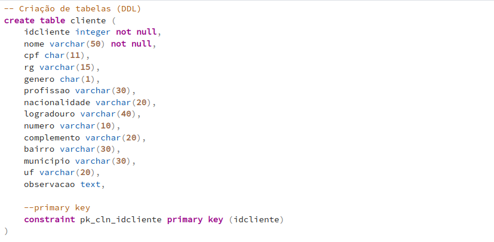
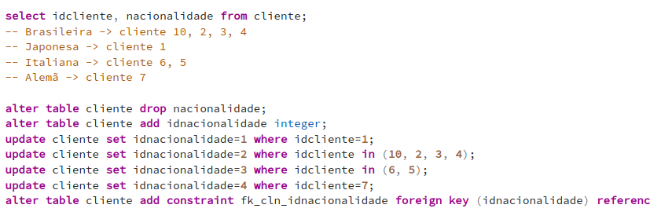

# Dados de Pedidos com PostgreSQL

A fim de aprender mais sobre esta tecnologia, estou desenvolvendo um projeto que consiste na organização de dados de cliente, com seus dados pessoais e pedidos feitos à uma
empresa. No próprio código temos o DDL para definir e caracterizar dados fictícios para criar tabelas e serem usados no projeto.

  

 
 ---
 
Com o uso da DML atualizei algumas tabelas para que hajam chaves primárias e estrangeiras, permitindo as relações dos mesmos.

  

